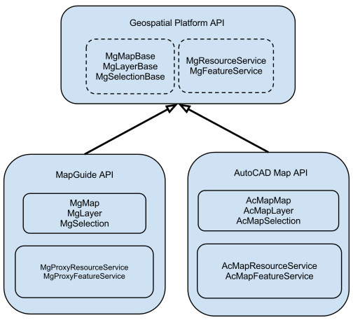

.. index:

Advanced MapGuide Topics
========================

Using Transactions
------------------

A transaction encapsulates a unit of work performed on a Feature Source that will either wholly succeed or wholly fail. Transactions ensure the Feature Source is kept in a consistent state whether the operation succeeded or the operation failed.

In the MapGuide API, the **MgTransaction** class represents the transaction to be performed in a Feature Source. The following example shows how to use a transaction over a series of feature operations:

**.net (C#)**

.. highlight:: csharp
.. code-block:: csharp

    //This code fragment assumes you have imported the OSGeo.MapGuide namespace
    MgTransaction trans = null;
    MgFeatureService featSvc = (MgFeatureService)siteConnection.CreateService(MgServiceType.FeatureService);
    MgResourceIdentifier featureSourceId = new MgResourceIdentifier("Library://Data/Test.FeatureSource");
    try
    {
        //Start the transaction, all changes below will not take effect until the transaction is committed
        trans = featSvc.StartTransaction(featureSourceId);
        //This does a SQL insert on the feature source
        featSvc.ExecuteSql(featureSourceId, "INSERT INTO TABLE1(ID, NAME) VALUES(123, 'Test'), trans);
        //This does a SQL update on the feature source
        featSvc.ExecuteSql(featureSourceId, "UPDATE TABLE1 SET NAME = 'Joe Bloggs' WHERE ID = 32", trans);
        //This does a SQL delete on the feature source
        featSvc.ExecuteSql(featureSourceId, "DELETE FROM TABLE1 WHERE ID = 456, trans);
        //Committing the transaction. The above changes will take effect
        trans.Commit();
    }
    catch (MgException ex)
    {
        //Rollback the transaction. Any changes that the above SQL commands would've
        //made are discarded
        if (trans != null)
            trans.Rollback();
    }

.. note::

    Transactions are only supported by certain FDO providers. Check the provider capabilities of the Feature Source to determine if Transactions are available.

Describing a Feature Source
---------------------------

A Feature Source represents a connection to a FDO data store. FDO data stores are modeled in the following fashion:

 * A data store contains 1 or more Feature Schemas
 * A Feature Schema contains 1 or more Class Definitions
 * A Class Definition contains 1 or more Property Definitions

The **MgFeatureService** class provides various methods for describing such aspects of a Feature Source

The following example lists the schema names of a Feature Source

**.net (C#)**

.. highlight:: csharp
.. code-block:: csharp

    //This code fragment assumes you have imported the OSGeo.MapGuide namespace
    MgFeatureService featSvc = (MgFeatureService)siteConnection.CreateService(MgServiceType.FeatureService);
    MgResourceIdentifier featureSourceId = new MgResourceIdentifier("Library://Data/Test.FeatureSource");
    MgStringCollection schemaNames = featSvc.GetSchemas(featureSourceId);
    Response.Write("
Schema Names:
<ul>");
    for (int i = 0; i < schemaNames.GetCount(); i++)
    {
        Response.Write("<li>" + schemaNames.GetItem(i) + "</li>");
    }
    Response.Write("</ul>");
    
The following example lists the class names for a given schema

**.net (C#)**

.. highlight:: csharp
.. code-block:: csharp

    //This code fragment assumes you have imported the OSGeo.MapGuide namespace
    MgFeatureService featSvc = (MgFeatureService)siteConnection.CreateService(MgServiceType.FeatureService);
    MgResourceIdentifier featureSourceId = new MgResourceIdentifier("Library://Data/Test.FeatureSource");
    MgStringCollection classNames = featSvc.GetClasses(featureSourceId, schemaName);
    Response.Write("
Class Names for " + schemaName + ":
<ul>");
    for (int i = 0; i < classNames.GetCount(); i++)
    {
        Response.Write("<li>" + classNames.GetItem(i) + "</li>");
    }
    Response.Write("</ul>");
    
Given a schema name and class name, the following example gets the matching class definition and writes out information about the class definition

**.net (C#)**

.. highlight:: csharp
.. code-block:: csharp

    //This code fragment assumes you have imported the OSGeo.MapGuide namespace
    MgFeatureService featSvc = (MgFeatureService)siteConnection.CreateService(MgServiceType.FeatureService);
    MgResourceIdentifier featureSourceId = new MgResourceIdentifier("Library://Data/Test.FeatureSource");
    MgClassDefinition classDef = featSvc.GetClassDefinition(featureSourceId, schemaName, className);
    Response.Write("
Name: " + classDef.GetName() + "
");
    Response.Write("
Description: " + classDef.GetDescription() + "
");
    Response.Write("
Default Geometry Property: " + classDef.GetDefaultGeometryPropertyName() + "
");
    MgPropertyDefinitionCollection identityProps = classDef.GetIdentityProperties();
    MgPropertyDefinitionCollection clsProps = classDef.GetProperties();
    Response.Write("
Class Properties (* are identity):
");
    Response.Write("<ul>");
    for (int i = 0; i < clsProps.GetCount(); i++)
    {
        MgPropertyDefinition propDef = clsProps.GetItem(i);
        Response.Write("<li>" + propDef.GetName());
        if (propDef.GetPropertyType() == MgFeaturePropertyType.AssociationProperty)
            Response.Write(" (Association)");
        else if (propDef.GetPropertyType() == MgFeaturePropertyType.DataProperty)
            Response.Write(" (Data)");
        else if (propDef.GetPropertyType() == MgFeaturePropertyType.GeometricProperty)
            Response.Write(" (Geometry)");
        else if (propDef.GetPropertyType() == MgFeaturePropertyType.ObjectProperty)
            Response.Write(" (Object)");
        else if (propDef.GetPropertyType() == MgFeaturePropertyType.RasterProperty)
            Response.Write(" (Raster)");
        Response.Write(")");
        if (identityProps.Contains(propDef))
            Response.Write(" *");
        Response.Write("</li>");
    }
    Response.Write("</li>");
    
Creating and Modifying Schemas
------------------------------

The MapGuide API, not only allows you to manipulate data in a data store, it also allows you to create and modify the structure of a data store. :ref:`create-feature-source` showed how to create a data store with a defined schema, the `ApplySchema` API allows you to modify such schemas.

The following example, modifies the `Default` schema by deleting the `Test` class definition inside

**.net (C#)**

.. highlight:: csharp
.. code-block:: csharp

    //This code fragment assumes you have imported the OSGeo.MapGuide namespace
    MgFeatureService featSvc = (MgFeatureService)siteConnection.CreateService(MgServiceType.FeatureService);
    MgResourceIdentifier featureSourceId = new MgResourceIdentifier("Library://Data/Test.FeatureSource");
    
    //Get the original "Test" schema
    MgFeatureSchemaCollection schemas = featSvc.DescribeSchema(featureSourceId, "Default");
    MgFeatureSchema schema = schemas.GetItem(0);
    
    //Find the "Test" class definition and set the deletion flag
    MgClassDefinitionCollection classes = schema.GetClasses();
    for (int i = 0; i < classes.GetCount(); i++)
    {
        MgClassDefinition cls = classes.GetItem(i);
        if (cls.GetName() == "Test")
        {
            cls.Delete(); //Mark this class definition for deletion
            break;
        }
    }
    
    //Apply the schema. This will delete the "Test" class definition
    featSvc.ApplySchema(featureSourceId, schema);
    
.. note::

    Not all data stores support the `ApplySchema` API. Check the FDO provider capabilities of the feature source to determine if such an operation is possible.

The Geospatial Platform and MapGuide's role in it
-------------------------------------------------

The MapGuide API shares common code with products like AutoCAD Map3D. The common code that is shared between MapGuide and AutoCAD Map3D is known as the Geospatial Platform API

The classes for the Geospatial Platform API resides in the MgPlatformBase.dll library and is accessible in .net via the OSGeo.MapGuide.PlatformBase.dll assembly.

By writing code that targets against the Geospatial Platform API (for example, using the `MgMapBase` class instead of `MgMap`) your code is easily portable between other products that are also built on top of it (like AutoCAD Map3D)