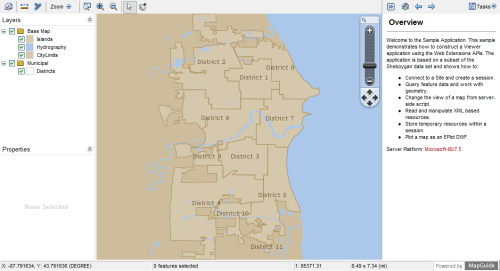
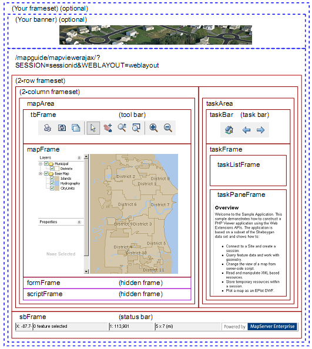

.. index::
   single: viewer

.. _mapguide-ajax-viewer:
   
The MapGuide AJAX Viewer
========================

Introduction
------------

.. todo::
    Remove reference to DWF viewer. It is deprecated

.. tip::

    The *Hello Viewer* sample, in the Developer's Guide samples, demonstrates
    concepts from this chapter.
    
The MapGuide Viewer is a browser-based method for displaying map data in a
MapGuide application. It is a complete application, with support for standard
mapping functionality like zooming, theming, and selecting features. There are
two different versions of the Viewer:

 * DWF Viewer, which runs only within Internet Explorer, and requires a browser plug-in
 * AJAX Viewer, which runs within Internet Explorer, Mozilla Firefox, and Safari, without requiring a browser plug-in
 
As much as possible, the two versions of the Viewer operate in the same way,
so deciding which to use depends on the needs of the application. If all the end
users of the application use Internet Explorer, the DWF Viewer my be an
appropriate choice, but if some of them use a different browser the AJAX Viewer
is a better choice.

Most MapGuide applications use a Viewer, though it is possible to create
applications that perform data analysis or manipulation but do not display
using the Viewer. For example, a MapGuide application can be used as a back-end
to another mapping application.

The standard Viewer displays a map along with the following optional
components surrounding the map:

 * Tool bar
 * Layers pane
 * Properties pane
 * Status bar
 * Task bar
 * Task list (normally hidden, but available as a drop-down from the task bar)
 * Task pane
 * Context (right-click) menu
 * Zoom slider (AJAX Viewer only)

**MapGuide Viewer**

The tool bar, task list, task pane, and context menu can contain a combination
of pre-defined and custom MapGuide commands.

A *web layout* defines how the Viewer looks and operates for a map. One
function of a web layout is to define which optional components display with
the map. All of the optional components can be disabled, leaving just the
map itself.

The web layout also defines any custom functionality added to the web page
through custom commands.

Custom Commands
^^^^^^^^^^^^^^^

Custom commands can be of two types:

 * JavaScript commands
 * Web Server Extensions pages, written in PHP, ASP.NET, or JSP
 
JavaScript commands are defined in the web layout as commands of type
Invoke Script. They are used primarily to interact with the Viewer, and can
use the Viewer API.

Web Server Extensions pages can be added to the web layout in two different
ways. In one method, the web layout includes a home page. This home page
is loaded in the task pane when the map first displays, and can be re-loaded
by clicking the Home icon in the task bar. The home page can load other
pages as needed.

In addition, other task pages can be defined in the web layout as commands
of type Invoke URL. These commands can be added to the tool bar, task list,
or context menu. When a user selects one of these commands the
corresponding URL is often loaded into the task pane, though it can also be
loaded into a hidden frame so it is not visible.

Because Web Server Extensions pages are created at the web tier before being
passed to the Viewer, they can use both the Web Server Extensions API and
the Viewer API.

Understanding Viewer Frames
---------------------------

The MapGuide Viewers use HTML frames to divide the viewer area. Refer to
the diagram below for the locations of the following frames and frame sets:

+------------------------+--------------------------------------------------------------+
| Name                   | Description                                                  |
+========================+==============================================================+
|                        | Unnamed. Contains all the Viewer frames. This can be wrapped |
|                        | by an outer frame so you can embed the Viewer in your own    |
|                        | site.                                                        |
+------------------------+--------------------------------------------------------------+
| maparea                | Frame set containing the tool bar, map frame, form frame,    |
|                        | andscript frame.                                             |
+------------------------+--------------------------------------------------------------+
| tbFrame                | Frame containing the tool bar. Add new commands to the tool  |
|                        | bar by modifying the web layout.                             |
+------------------------+--------------------------------------------------------------+
| mapFrame               | Frame containing the map data. This includes the map display |
|                        | and the layers and properties palettes.                      |
+------------------------+--------------------------------------------------------------+
| formFrame              | Hidden frame that can be used to generate HTTP POST requests |
|                        | for sending data to the server.                              |
+------------------------+--------------------------------------------------------------+
| scriptFrame            | Hidden frame that can be used to load and execute pages      |
|                        | out them being visible to the user. This is often used for   |
|                        | executing client-side JavaScript.                            |
+------------------------+--------------------------------------------------------------+
| taskArea               | Frame set containing the task bar and the task frame.        |
+------------------------+--------------------------------------------------------------+
| taskBar                | Frame containing the task bar                                |
+------------------------+--------------------------------------------------------------+
| taskFrame              | Frame used to hold the task list frame and the task pane     |
|                        | frame                                                        |
+------------------------+--------------------------------------------------------------+
| taskListFrame          | Frame used for displaying the task list. This is normally    |
|                        | hidden, and is shown when a user clicks the task list button | 
|                        | in the task bar. Add new commands to the task list by        |
|                        | modifying the web layout.                                    |
+------------------------+--------------------------------------------------------------+
| taskPaneFrame          | Frame used for displaying and executing MapGuide pages. A    |
|                        | web layout has a default home page that displays in the task |
|                        | pane when the layout loads. Custom commands of type Invoke   |
|                        | URL also load in the task pane.                              |
+------------------------+--------------------------------------------------------------+
| sbFrame                | Frame containing the status bar.                             |
+------------------------+--------------------------------------------------------------+

MapGuide Viewer API
-------------------

The MapGuide Viewer API is a set of JavaScript functions used to interact with
the Viewer. Many of the Viewer frames contain embedded JavaScript functions
that can be called from other locations. For full details about the available
functions, refer to the online *MapGuide Viewer API Reference*.

To execute any of the Viewer API functions, call them from JavaScript
embedded in a page. There are three common techniques for this:

 * Define an Invoke Script command in the web layout. Use this technique when you want to call the Viewer API directly from the tool bar, task list, or context menu.
 * Load a page into the hidden script frame and execute the script when the page loads. Use this technique when you want the Viewer to change as a result of an action in the MapGuide page, without reloading the page.
 * Execute the JavaScript call from a page loaded in the task pane frame. The JavaScript can execute when the page first loads or as a result of user interaction.

It is important to know the relationships between the frames. JavaScript
executes in the context of a single frame, but it can call functions from other
frames by locating them in the frame hierarchy. The following frames are
children of the main Viewer frame:

 * tbFrame
 * mapFrame
 * formFrame
 * scriptFrame
 * taskFrame
 
The ``taskPaneFrame`` is a child of the taskFrame.

Custom JavaScript code can execute in the context of the main frame, the
script frame, or the task pane frame.

JavaScript defined as an Invoke Script command executes in the context of
the main frame. To execute functions in one of the other frames, identify the
function with the frame name and function name. For example, the following
calls the ``ZoomToView()`` function of the mapFrame from the main frame:

.. highlight:: javascript
.. code-block:: javascript

    mapFrame.ZoomToView(xLoc, yLoc, newScale, true);

JavaScript loaded into the ``scriptFrame`` must go up 1 level in the hierarchy
using parent. For example:

.. highlight:: javascript
.. code-block:: javascript

    parent.mapFrame.ZoomToView(xLoc, yLoc, newScale, true);

JavaScript loaded into the ``taskPaneFrame`` must go up 2 levels in the hierarchy
using ``parent.parent``. For example:

.. highlight:: javascript
.. code-block:: javascript

    parent.parent.mapFrame.ZoomToView(xLoc, yLoc, newScale, true);

Many Viewer API calls will generate requests to the site server, either to refresh
data in the Viewer or to notify the site server of a change in Viewer state.
These requests are generated automatically.

Calling the Viewer API with an Invoke Script Command
^^^^^^^^^^^^^^^^^^^^^^^^^^^^^^^^^^^^^^^^^^^^^^^^^^^^

Use this technique when you want to call the API directly from the tool bar,
task list, or context menu.

For example, you may want to create a tool bar button that zooms and
positions the map to show a particular location. In the web layout, create a
command of type Invoke Script. Enter the API call as the script to invoke:

.. highlight:: javascript
.. code-block:: javascript

    ZoomToView(-87.7116768, 43.7766789973, 5000, true);

Add the button to the tool bar. When a user clicks the button, the map view
repositions to the location.

Commands of type Invoke Script always execute in the context of the main
frame. This means that all main frame functions are available. To execute a
function in another frame, use the frame name as part of the function name.
For example, ``formFrame.Submit()``.

Calling the Viewer API from the Script Frame
^^^^^^^^^^^^^^^^^^^^^^^^^^^^^^^^^^^^^^^^^^^^

Use this technique when you want the Viewer API calls to be made as a result
of an action in the calling page, but you do not want to reload the page. For
example, you may have a page that generates a list of locations and you would
like the user to be able to jump directly to any location, while leaving the list
still available in the task pane.

In this case, your page can load another page in the hidden script frame, using
``target="scriptFrame"`` as part of the ``<a>`` tag. This requires creating a separate
page to load in the script frame and passing the necessary parameters when
the page loads.

The Hello Viewer sample application contains a file named ``gotopoint.php``
that is designed to run in the script frame. The ``<body>`` element is empty, so
the page does not produce any output. Instead, it emits a JavaScript function
to execute when the page loads. This function calls the ``ZoomToView()`` function
in the Viewer API. The essential parts of ``gotopoint.php`` are:

**PHP (gotopoint.php)**

.. highlight:: php
.. code-block:: php

    
    <body onLoad="OnPageLoad()">
    </body>

**.net (gotopoint.aspx)**

.. highlight:: csharp
.. code-block:: csharp

    Code sample coming soon!

**Java (gotopoint.jsp)**

.. highlight:: java
.. code-block:: java

    Code sample coming soon!
    
To execute ``gotopoint.php`` from the task frame, insert code similar to the
following:

**PHP**

.. highlight:: php
.. code-block:: php

    $xLocation = -87.7116768; // Or calculate values
    $yLocation = 43.7766789973;
    $mapScale = 2000;
    echo "
<a href=\"gotopoint.php?" .
    "X=$xLocation&Y=$yLocation&Scale=$mapScale\"" .
    "target=\"scriptFrame\">Click to position map</a>
";

**.net**

.. highlight:: csharp
.. code-block:: csharp

    Code sample coming soon!

**Java**

.. highlight:: java
.. code-block:: java

    Code sample coming soon!

.. note::

    This technique is also appropriate for calling the Web API without reloading the task pane. See the Modifying Maps and Layers sample for an example.

Calling the Viewer API from the Task Pane
^^^^^^^^^^^^^^^^^^^^^^^^^^^^^^^^^^^^^^^^^

Use this technique when you want the Viewer API calls to be made when the
page loads or as a result of an ``onclick`` event. For example, if you have a task
in the task list that zooms the map to a pre-defined location, then you do not
need any user input. The Viewer should zoom as soon as the page loads.

The map frame contains a JavaScript function to center the map to a given
coordinate at a given map scale. To call this function from a page loading in the task pane, 
create a function that will be executed when the ``onLoad`` event occurs. The following is a simple 
example. If you add this to the task list and select the task, the displayed map will reposition to the given location.

.. highlight:: html
.. code-block:: html

    <html>
    <head>
    <title>Viewer Sample Application - Zoom</title>
    </head>
    
    <body onLoad="OnPageLoad()">
    <h1>Zooming...</h1>
    </body>
    </html>

Use a similar technique to call custom JavaScript based on an action in the
task pane, like clicking a link.

Extending Map Initialization Functionality
^^^^^^^^^^^^^^^^^^^^^^^^^^^^^^^^^^^^^^^^^^

.. todo::
    There are initialization code samples in the wiki that are useful here

At times, it may be necessary to perform some initialization functions when
the map first loads. To accomplish this, a page loaded into the task pane can
hook into the standard map initialization process.

For example, when a browser first connects to a MapGuide site, it specifies a
web layout. The site uses this layout to determine which Viewer components
to enable and which map to display in the map area. At the time that the task
pane first loads, the map name is not yet known. It may be required for some
operations, though.

The Hello Viewer Sample
^^^^^^^^^^^^^^^^^^^^^^^

The Hello Viewer sample, installed with the Developer's Guide samples, shows
simple examples of using the Viewer API from different parts of a web layout.

The tool bar for the sample contains a custom Invoke Script command that
calls the ``ZoomToView()`` function of the ``mapFrame``. This is executed in the context
of the main frame, so the function is available using

.. highlight:: javascript
.. code-block:: javascript

    mapFrame.ZoomToView()

The task pane loads a page that shows two other ways of calling ``ZoomToView()``.
One way loads a custom page into the hidden ``scriptFrame``. The page reads
``GET`` parameters and passes them to the JavaScript function call. This is executed
in the context of the ``scriptFrame``, so ``ZoomToView()`` is available using

.. highlight:: javascript
.. code-block:: javascript

    parent.mapFrame.ZoomToView()

Another way calls ``ZoomToView()`` directly when a link is clicked, using the
JavaScript ``onclick`` event. This is executed in the context of the ``taskPaneFrame``,
so ``ZoomToView()`` is available using

.. highlight:: javascript
.. code-block:: javascript

    parent.parent.mapFrame.ZoomToView()

The Developer's Guide samples also demonstrate a more advanced method
for using JavaScript in a Viewer. The file *index.php* includes an external
JavaScript file that solves 2 problems:

 * When a map is first loading, the task pane displays before the map has been fully initialized. This can cause problems if users click any links in the task pane that depend on the map being available.
 * The first time the Viewer loads a page into the task pane, it passes ``SESSION`` and ``WEBLAYOUT`` as ``GET`` parameters. The map name is not known until after the web layout has loaded. When a user clicks the Home button, the Viewer reloads the home page in the task pane, but passes ``SESSION`` and ``MAPNAME`` as ``GET`` parameters instead. In some cases, it may be useful for the home page to have the map name when it first loads.
 
To deal with these problems, the Hello Viewer sample loads ``pageLoadFunctions.js``, which attaches a function 
to the ``window.onload`` event of the page in the task pane. This function does the following:

 * Replaces the ``OnMapLoaded()`` function of the main frame. This function is called after the map has been fully initialized. The new version performs some initialization (see below), then calls the original ``OnMapLoaded()``.
 * Saves the contents of the task pane page and replaces it with the text "Loading...".
 * After the map is fully initialized, it calls the new version of ``OnMapLoaded()``. At this point, the map name is known, and is available from the ``mapFrame.GetMapName()`` function. The new version of ``OnMapLoaded()`` restores the contents of the task pane page, then it searches all ``<a>`` elements, replacing "``MAPNAME=unknown``" with the correct map name in the ``href`` attributes.

See the Hello Viewer sample for links to view *index.php* and *pageLoadFuctions.js*.

Embedding a Viewer in Your Own Page
-----------------------------------

The simplest way to incorporate a MapGuide Viewer into your own site is to
create a frame set that contains a frame for your own page layout and a frame
for the Viewer. The Developer's Guide samples use this technique. The main
page for the samples, *main.php*, creates a frame set where the top frame in the
set contains a site-specific page header, and the bottom frame in the set
contains the embedded Viewer. The following code contains the important
parts of *main.php*.

**PHP**

.. highlight:: php
.. code-block:: php

    <!DOCTYPE HTML PUBLIC "-//W3C//DTD HTML 4.01 Frameset//EN"
    "http://www.w3.org/TR/html4/frameset.dtd">
    <?php
    require_once('common/common.php');

    try
    {
        // Initialize the web extensions,
        MgInitializeWebTier ($webconfigFilePath);

        // Connect to the site server and create a session
        $userInfo = new MgUserInformation("Author", "author");
        $site = new MgSite();
        $site->Open($userInfo);
    }
    catch (MgException $e)
    {
        echo "Could not connect to the MapGuide site server.";
        die();
    }

    try
    {
        $sessionId = $site->CreateSession();

        // Define some constants
        $webLayout = "Library://Samples/Layouts/SamplesPHP.WebLayout";
        $title = "Samples";
    }
    catch (MgException $e)
    {
        echo "ERROR: " . $e->GetMessage("eng") . "\n";
        echo $e->GetStackTrace("eng") . "\n";
    }
    ?>

    <html>
        <head>
            <title><?= $title ?></title>
        </head>
        <frameset rows="110,*">
            <frame src="common/Title.php?TitleText=<?= $title ?>" name="TitleFrame" scrolling="NO" noresize />
            <frame src="/mapguide/mapviewerajax/?SESSION=<?= $sessionId ?>&WEBLAYOUT=<?= $webLayout ?>" name="ViewerFrame" />
        </frameset>
    </html>
    
**.net (C#)**

.. highlight:: csharp
.. code-block:: csharp

    Code sample coming soon!

**Java**
    
.. highlight:: java
.. code-block:: java

    Code sample coming soon!